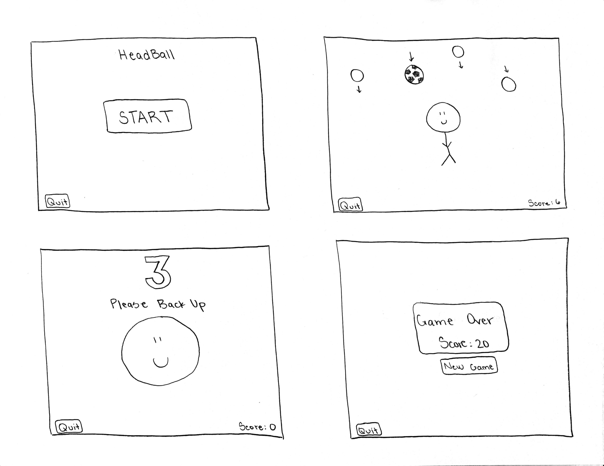
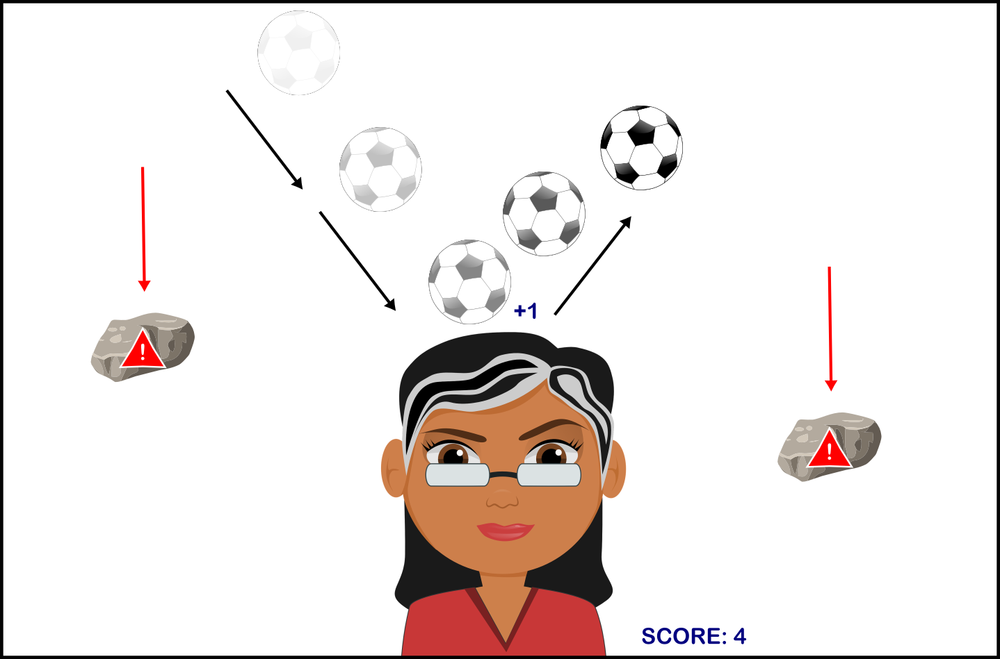

# HeadBall

Github Repo: https://github.com/BlaineSieck/HeadBall  
Presentation Page: https://blainesieck.github.io/HeadBall/

**Team Members**

Gabriel Costanzo (Team Leader) - falling objects and collision control    
Blaine Sieck - facial recognition and menu

**Functionality**

- Main menu will have a start button and a quit button
- Once you press start you will be prompted to back up if you are too close to the camera
- Once correctly positioned, there will be a countdown timer before the game starts
- A soccer ball will fall from the top of the screen and your goal is to bounce it off your head and continue to do so while avoiding other falling objects
- If one of the falling objects hits you or you drop the soccer ball the game will end and your score will be displayed on the screen

**Implementation**
- we have looked into the facial recognition API
- discussed physics of falling objects
- no code written yet

**Plan Moving Forward**
- implement the above ideas

# User Study

**Task Description**  
- the user will move around in frame of the webcam in order to bounce the ball off of their head

**Hypothesis**  
- we believe we may run into some confusion regarding the final product since the demo is a very early version of the final game and is missing a significant amount of other features that will be implemented in the future
- the ball physics are also kind of strange at the moment and make bouncing the ball on your head quite difficult, which may frustrate users (however, the final game should be much more enjoyable)

# Final Product  

**Demo Gif**  
  

